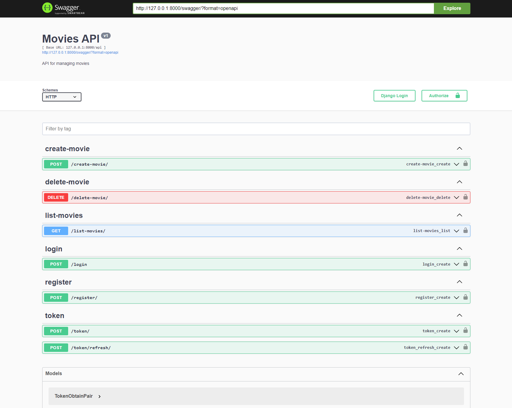

# General overview
API application Back-End part made in Python Django for use with Front-end which does saving movies which you viewd before on a website which pirated it so in case you want to rewatch the movie again you could just click on the movie so that it automatically opens up the previouse website where you viewed that movie. 

# Building process

Use the following commands in order to start the back-end application, but without the front-end you can only visualize the results in swagger or Postman.
```
python3 manage.py runserver
```
After which you can make localhost requests to the endpoints/views to get the results back using the following link [Swagger](http://127.0.0.1:8000/swagger/)

# Features
- Ability to view the movies from the database in json via GET Request
- Ability to add new movies to the database with a json via POST Request
- Ability to delete a movie from the database with a json via DELETE REQUEST
- Ability to login with permissions via a POST Request
- Ability to go to view Movies in items of 10 by page via GET Request
- Ability to register with a POST Request with the permissions
- Ability to generate or renew JW Tokens

# How it should look



## Aditional Notes:
The application will work even without the frontend but the visualisation of data can only be done in Swagger as shown earlier or Postman requests or just start the Front-end application found [here](https://github.com/LeonidCaminschi/tum-web-lab6). You must start both front-end and back-end in order for visualisation of data on the front-end.

